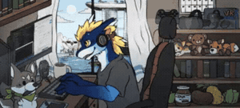

<!-- Animated Header Wave -->
<svg viewBox="0 0 800 200" xmlns="http://www.w3.org/2000/svg" width="100%">
  <defs>
    <linearGradient id="skyGrad" x1="0%" y1="0%" x2="0%" y2="100%">
      <stop offset="0%" style="stop-color:#0a1628;stop-opacity:1" />
      <stop offset="100%" style="stop-color:#0d2847;stop-opacity:1" />
    </linearGradient>
    <linearGradient id="wave1" x1="0%" y1="0%" x2="100%" y2="0%">
      <stop offset="0%" style="stop-color:#1a5fb4;stop-opacity:0.8" />
      <stop offset="50%" style="stop-color:#3584e4;stop-opacity:0.9" />
      <stop offset="100%" style="stop-color:#1a5fb4;stop-opacity:0.8" />
    </linearGradient>
    <linearGradient id="wave2" x1="0%" y1="0%" x2="100%" y2="0%">
      <stop offset="0%" style="stop-color:#0d5cb4;stop-opacity:0.6" />
      <stop offset="50%" style="stop-color:#1c71d8;stop-opacity:0.7" />
      <stop offset="100%" style="stop-color:#0d5cb4;stop-opacity:0.6" />
    </linearGradient>
    <linearGradient id="wave3" x1="0%" y1="0%" x2="100%" y2="0%">
      <stop offset="0%" style="stop-color:#62a0ea;stop-opacity:0.4" />
      <stop offset="50%" style="stop-color:#99c1f1;stop-opacity:0.5" />
      <stop offset="100%" style="stop-color:#62a0ea;stop-opacity:0.4" />
    </linearGradient>
  </defs>
  <!-- Background -->
  <rect width="800" height="200" fill="url(#skyGrad)" rx="12"/>
  <!-- Stars -->
  <circle cx="50" cy="30" r="1.5" fill="#ffffff" opacity="0.8">
    <animate attributeName="opacity" values="0.8;0.2;0.8" dur="3s" repeatCount="indefinite"/>
  </circle>
  <circle cx="150" cy="50" r="1" fill="#ffffff" opacity="0.6">
    <animate attributeName="opacity" values="0.6;0.1;0.6" dur="4s" repeatCount="indefinite"/>
  </circle>
  <circle cx="700" cy="40" r="1.5" fill="#ffffff" opacity="0.7">
    <animate attributeName="opacity" values="0.7;0.3;0.7" dur="2.5s" repeatCount="indefinite"/>
  </circle>
  <circle cx="650" cy="70" r="1" fill="#ffffff" opacity="0.5">
    <animate attributeName="opacity" values="0.5;0.1;0.5" dur="3.5s" repeatCount="indefinite"/>
  </circle>
  <circle cx="250" cy="25" r="1" fill="#ffffff" opacity="0.6">
    <animate attributeName="opacity" values="0.6;0.2;0.6" dur="5s" repeatCount="indefinite"/>
  </circle>
  <!-- Moon -->
  <circle cx="720" cy="55" r="25" fill="#f6f5f4" opacity="0.9"/>
  <circle cx="710" cy="50" r="22" fill="#0d2847" opacity="0.3"/>
  <!-- Animated Waves -->
  <path fill="url(#wave3)">
    <animate attributeName="d" 
      dur="7s" 
      repeatCount="indefinite"
      values="
        M0,160 C200,140 300,180 500,150 C600,135 700,165 800,155 L800,200 L0,200 Z;
        M0,155 C200,175 300,135 500,165 C600,180 700,150 800,160 L800,200 L0,200 Z;
        M0,160 C200,140 300,180 500,150 C600,135 700,165 800,155 L800,200 L0,200 Z"
    />
  </path>
  <path fill="url(#wave2)">
    <animate attributeName="d" 
      dur="5s" 
      repeatCount="indefinite"
      values="
        M0,170 C150,150 350,190 550,160 C650,145 750,175 800,165 L800,200 L0,200 Z;
        M0,165 C150,185 350,145 550,175 C650,190 750,160 800,170 L800,200 L0,200 Z;
        M0,170 C150,150 350,190 550,160 C650,145 750,175 800,165 L800,200 L0,200 Z"
    />
  </path>
  <path fill="url(#wave1)">
    <animate attributeName="d" 
      dur="4s" 
      repeatCount="indefinite"
      values="
        M0,180 C180,165 320,185 520,170 C620,160 720,180 800,175 L800,200 L0,200 Z;
        M0,175 C180,190 320,170 520,185 C620,195 720,175 800,180 L800,200 L0,200 Z;
        M0,180 C180,165 320,185 520,170 C620,160 720,180 800,175 L800,200 L0,200 Z"
    />
  </path>
  <!-- Text -->
  <text x="400" y="85" text-anchor="middle" font-family="monospace" font-size="32" font-weight="bold" fill="#ffffff">
    🐉 Hi There, I'm Lawless
  </text>
  <text x="400" y="115" text-anchor="middle" font-family="monospace" font-size="14" fill="#99c1f1">
    Industrial Engineer | IoT Tinkerer | Android Dev | Blue Dragon
  </text>
</svg>

<!-- Typing Animation -->

<!-- Character GIF -->

  
    

<!-- ABOUT ME CARD -->

<table>
<tr>
<td width="50%">

<h3 align="center">🧑‍💻 About Me</h3>

🎓 ROLE INDUSTRIAL ENGINEERING STUDENT
💼 EX JOB LG ELECTRONICS INDONESIA
📜 IP 2 HKI REGISTERED
🔧 TINKERING ESP32 / IOT
🏗️ BUILDING KOTLIN + COMPOSE
🐉 IDENTITY BLUE DRAGON FURRY
📷 ALSO RAILFAN / PHOTOGRAPHER

</td>
<td width="50%">

<h3 align="center">🚀 What I'm Building</h3>

ANIFLOW ANDROID ANIME APP
SMART-INCUBATOR IOT FAIL-SAFE SYSTEM
RAILFURS COMMUNITY WEBSITE

<h3 align="center">📊 Quick Stats</h3>

 

 

</td>
</tr>
</table>

<!-- TECH STACK CARD -->

<h3 align="center">🛠️ Tech Stack</h3>

  

<!-- GITHUB STATS CARDS -->

<table>
<tr>
<td width="50%">

<h3 align="center">📈 GitHub Stats</h3>

</td>
<td width="50%">

<h3 align="center">🔥 Streak Stats</h3>

</td>
</tr>
</table>

<!-- CONNECT CARD -->

<h3 align="center">🌐 Connect With Me</h3>

FURSONA BLUE DRAGON VIEWS 8 FOLLOWERS 1

<!-- FOOTER WAVE -->

<svg viewBox="0 0 800 80" xmlns="http://www.w3.org/2000/svg" width="100%">
  <defs>
    <linearGradient id="footGrad" x1="0%" y1="0%" x2="100%" y2="0%">
      <stop offset="0%" style="stop-color:#1a5fb4;stop-opacity:1" />
      <stop offset="50%" style="stop-color:#3584e4;stop-opacity:1" />
      <stop offset="100%" style="stop-color:#1a5fb4;stop-opacity:1" />
    </linearGradient>
  </defs>
  <path fill="url(#footGrad)" opacity="0.8">
    <animate attributeName="d" 
      dur="6s" 
      repeatCount="indefinite"
      values="
        M0,40 C200,20 300,60 500,30 C600,15 700,45 800,35 L800,80 L0,80 Z;
        M0,35 C200,55 300,15 500,45 C600,60 700,30 800,40 L800,80 L0,80 Z;
        M0,40 C200,20 300,60 500,30 C600,15 700,45 800,35 L800,80 L0,80 Z"
    />
  </path>
  <text x="400" y="60" text-anchor="middle" font-family="monospace" font-size="12" fill="#c0caf5" opacity="0.8">
    🐉 Crafted with blue dragon energy — LawlessDragon 🐉
  </text>
</svg>

